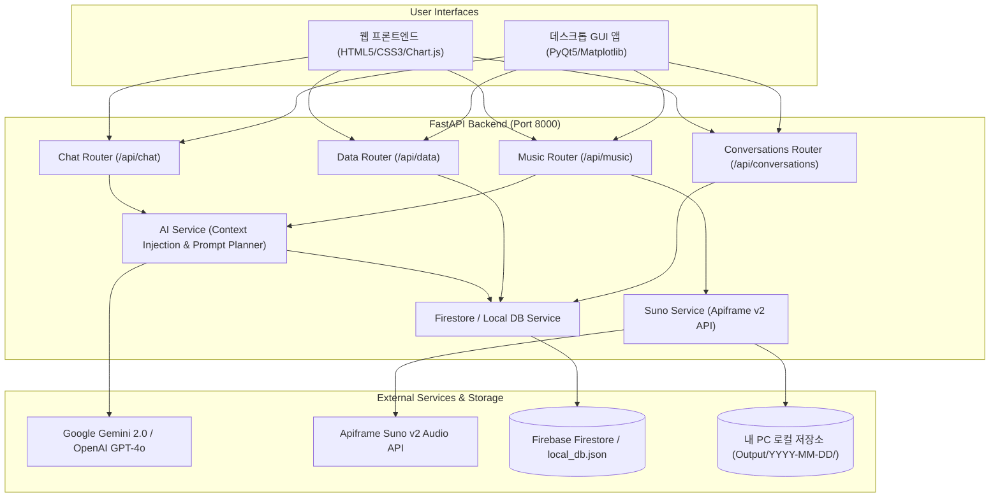

# 🎵 AI Assistant & Suno AI Music Studio (나만의 AI 비서 & 맞춤 음원 생성기)

<div align="center">

[](https://www.python.org/)
[](https://fastapi.tiangolo.com/)
[](https://pypi.org/project/PyQt5/)
[](https://ai.google.dev/)
[-FF5722)](https://apiframe.ai/)
[](https://firebase.google.com/)
[](LICENSE)

**사용자의 일상과 컨디션 시계열 데이터를 깊이 이해하고, 실시간 맞춤형 힐링 음악(Suno AI)을 기획하여 내 PC로 자동 다운로드해 주는 올인원 AI 에이전트 시스템**

[🌐 웹 대시보드](https://a1-3-project.vercel.app/) • [📖 Swagger API 문서](https://ai-assistant-backend.onrender.com/docs) • [🚀 빠른 시작](#4-로컬-실행-가이드-quick-start)

</div>

---

## 1. 📌 프로젝트 개요 (Overview)

단순한 일회성 챗봇을 넘어, 사용자의 **시계열 컨디션/기분 데이터(날짜, 지수, 메모)를 저장 및 분석**하여 AI 시스템 프롬프트에 실시간 주입(**Context Injection**)합니다.

이를 통해 AI 비서가 사용자의 최근 상태 변화와 트렌드를 파악한 공감 대화를 나누며, 컨디션에 어울리는 **10가지 Suno AI 음악 프롬프트를 자동으로 기획**하고, **Apiframe Suno API v2를 통해 실제 MP3 음원을 생성한 뒤 사용자의 PC 로컬 디스크로 바로 저장**할 수 있는 원스톱 라이프케어 솔루션입니다.

### 🌟 핵심 차별점
1. **컨텍스트 주입 (Context Injection)**: Firestore 시계열 데이터(평균 점수, 최근 트렌드 등)를 AI 프롬프트에 자동 반영
2. **Suno AI 음원 기획 & 생성 파이프라인**: 10가지 트랙 기획(보컬/연주곡 선택) ➔ Apiframe Suno v2 API 비동기 생성 ➔ 실시간 작업 상태 폴링
3. **내 PC 로컬 다운로드**: 생성된 고음질 MP3 음원을 날짜별 폴더(`Output/YYYY-MM-DD/`)로 즉시 자동 저장
4. **듀얼 인터페이스 지원**: 웹 브라우저용 반응형 대시보드(Glassmorphism Web) + PyQt5 기반 독립형 네이티브 데스크톱 GUI 프로그램 제공
5. **안정적인 폴백(Fallback) 아키텍처**: Firestore 미설정 시 로컬 JSON DB 자동 전환, OpenAI 미설정 시 Google Gemini 2.0 자동 전환

---

## 2. 🏛️ 시스템 아키텍처 & 데이터 흐름 (Architecture)



---

## 3. 🛠️ 기술 스택 (Tech Stack)

| 영역 | 기술 / 라이브러리 | 상세 설명 |
| :--- | :--- | :--- |
| **Backend** | Python 3.10+, FastAPI, Uvicorn, Pydantic v2 | 고성능 비동기 REST API 서버 구축 및 요청 유효성 검증 |
| **Desktop GUI** | PyQt5, Matplotlib | 윈도우 네이티브 올인원 데스크톱 클라이언트 (차트 시각화 및 오디오 플레이어 탑재) |
| **AI Models** | Google Gemini API (`gemini-2.0-flash`), OpenAI API (`gpt-4o-mini`) | 맞춤 컨텍스트 기반 공감 대화 및 10가지 음악 프롬프트 자동 기획 |
| **Music AI** | Apiframe Suno API v2 (`/v2/music/generate`, `/v2/jobs/{id}`) | Suno AI 음악 실시간 생성 및 작업 상태 폴링 |
| **Database** | Firebase Firestore (`firebase-admin`), Local JSON Fallback | 클라우드 NoSQL 데이터베이스 및 오프라인 로컬 저장소 지원 |
| **Frontend** | Vanilla HTML5, Modern CSS3 (Glassmorphism), JavaScript (ES6+), Chart.js | 반응형 웹 UI, 시계열 통계 인터랙티브 차트 |
| **Deployment** | Render (백엔드 Web Service), Vercel (프론트엔드 정적 호스팅) | 클라우드 자동 지속적 배포 환경 |

---

## 4. 🚀 로컬 실행 가이드 (Quick Start)

### 1) 저장소 클론 및 가상환경 설정
```bash
# 저장소 복제
git clone https://github.com/oransee1/M1-2.git
cd M1-2

# 가상환경 생성 (Python 3.10+ 권장)
python -m venv .venv

# 가상환경 활성화
# Windows PowerShell:
.venv\Scripts\Activate.ps1
# macOS / Linux:
source .venv/bin/activate

# 필수 패키지 설치
pip install -r requirements.txt
```

### 2) 환경 변수 설정 (`.env`)
프로젝트 루트 폴더에 `.env` 파일을 생성하고 발급받은 API 키를 입력합니다 (참고: [`.env.example`](.env.example)):

```env
# AI Models (최소 1개 설정 권장)
OPENAI_API_KEY=your_openai_api_key_here
GEMINI_API_KEY=your_gemini_api_key_here

# Suno AI Generation (Apiframe v2 API 키)
APIFRAME_API_KEY=your_apiframe_api_key_here

# Firebase Firestore (선택 - 비워둘 경우 services/local_db.json 자동 사용)
FIREBASE_SERVICE_ACCOUNT_JSON=firebase-service-account.json

# CORS & 로컬 다운로드 디렉토리
ALLOWED_ORIGINS=*
MUSIC_DOWNLOAD_DIR=Output
```

### 3) 실행 옵션 A: PyQt5 데스크톱 GUI 앱 실행 (강력 추천 🌟)
별도의 웹 브라우저나 복잡한 설정 없이, 클릭 한 번으로 모든 기능(데이터 관리, AI 대화, 음악 생성, 실시간 재생 및 PC 저장)을 사용하실 수 있습니다.
```bash
python app_gui.py
```

### 4) 실행 옵션 B: FastAPI 웹 서버 실행
```bash
uvicorn main:app --reload --host 127.0.0.1 --port 8000
```
- **웹 대시보드 접속**: `http://127.0.0.1:8000` 또는 `http://localhost:8000`
- **인터랙티브 API 문서 (Swagger UI)**: `http://127.0.0.1:8000/docs`
- **ReDoc 문서**: `http://127.0.0.1:8000/redoc`

---

## 5. 📂 디렉토리 구조 (Directory Structure)

```plaintext
M1-2/
├── .env.example                # 환경 변수 템플릿 파일
├── .gitignore                  # Git 제외 파일 목록 (비공개 키, 캐시, 가상환경 등)
├── Procfile                    # Render / 클라우드 배포 실행 스크립트
├── README.md                   # 프로젝트 상세 문서 (본 파일)
├── render.yaml                 # Render 인프라 설정 명세서
├── requirements.txt            # 파이썬 의존성 패키지 목록
├── vercel.json                 # Vercel 프론트엔드 라우팅 설정
│
├── main.py                     # FastAPI 앱 진입점 및 라우터 마운트
├── config.py                   # 환경 변수 로드 및 설정 관리
├── schemas.py                  # Pydantic 데이터 검증 모델 정의
├── export_to_sheets.py         # Google 스프레드시트 내보내기 유틸리티
│
├── app_gui.py                  # PyQt5 데스크톱 네이티브 GUI 애플리케이션
├── index.html                  # 웹 대시보드 메인 HTML 페이지
├── styles.css                  # 글래스모피즘 & 반응형 CSS 스타일시트
├── app.js                      # 프론트엔드 비동기 API 통신 및 UI 로직
│
├── routers/                    # FastAPI 라우터 모듈
│   ├── chat_router.py          # AI 비서 챗봇 및 컨텍스트 주입 엔드포인트
│   ├── conversations_router.py # 대화 히스토리 CRUD 및 불러오기 엔드포인트
│   ├── data_router.py          # 시계열 컨디션 데이터 CRUD 및 통계 요약
│   └── music_router.py         # Suno 음악 기획, 생성, 상태조회, 다운로드
│
├── services/                   # 비즈니스 로직 계층
│   ├── ai_service.py           # 프롬프트 구성, 컨텍스트 주입, 10곡 자동 기획
│   ├── firestore_service.py    # Firestore 연동 및 Local JSON Fallback 지원
│   ├── suno_service.py         # Apiframe Suno API v2 통신 및 MP3 저장
│   └── local_db.json           # 로컬 Fallback 시계열 및 대화 데이터 저장소
│
└── suno_prompts_*.csv          # 기본 테마별 Suno 프롬프트 샘플 데이터셋
    ├── suno_prompts_10.csv
    ├── suno_prompts_instrumental.csv
    └── suno_prompts_with_lyrics.csv
```

---

## 6. 🔌 REST API 명세 (API Reference)

### 1) AI Chat (`/api/chat`)
- `POST /api/chat`: 시계열 데이터 요약이 주입된 AI 응답 생성 및 대화 자동 저장

### 2) Time Series Data (`/api/data`)
- `POST /api/data`: 새 시계열 컨디션/기분 데이터 추가 (`date`, `value`, `memo`)
- `GET /api/data`: 저장된 전체 시계열 데이터 목록 조회
- `GET /api/data/summary`: AI 시스템 프롬프트 주입용 통계 요약 (평균, 최고/최저, 추세 등)
- `PUT /api/data/{data_id}`: 특정 데이터 항목 수정
- `DELETE /api/data/{data_id}`: 특정 데이터 항목 삭제

### 3) Conversations History (`/api/conversations`)
- `GET /api/conversations`: 이전 대화 세션 목록 조회
- `GET /api/conversations/{conv_id}`: 특정 대화 상세 메세지 불러오기 (Load UX)
- `POST /api/conversations`: 대화 세션 수동 저장
- `DELETE /api/conversations/{conv_id}`: 특정 대화 세션 삭제

### 4) Suno AI Music (`/api/music`)
- `POST /api/music/plan`: 사용자 상태 기반 10가지 Suno 음악 프롬프트 자동 기획
- `POST /api/music/generate`: 선택한 프롬프트로 Apiframe Suno v2 음원 생성 요청
- `GET /api/music/status/{task_id}`: 작업 진행 상태 확인 (`PENDING` ➔ `SUCCESS`, MP3 URL 반환)
- `POST /api/music/download`: 생성된 음원을 내 PC 로컬 디렉토리로 다운로드

---

## 7. 🎯 주요 화면 및 기능 안내 (Features Showcase)

1. **📊 시계열 컨디션 데이터 관리 & 차트 시각화**
   - 날짜별 기분 점수(1~10)와 일상 메모를 직관적으로 기록하고, Chart.js / Matplotlib을 통해 시각적 트렌드 파악.
2. **💬 맥락을 이해하는 AI 비서 (Context Injection)**
   - "최근 컨디션 점수가 7.2점으로 상승세네요! 오늘 기분은 어떠신가요?"와 같이 저장된 기록을 토대로 맞춤형 공감과 솔루션 제공.
3. **🎼 10가지 Suno AI 맞춤 음악 기획 스튜디오**
   - 보컬 곡(가사 생성 포함) 또는 연주곡(Instrumental) 모드를 선택하여 한 번에 10개의 다채로운 테마 프롬프트 자동 생성.
4. **⚡ 실시간 음원 생성 & 로컬 PC 자동 저장**
   - 생성 요청 후 실시간 프로그레스 바로 상태를 추적하고, 완성 시 내 PC의 `Output/YYYY-MM-DD/` 폴더에 MP3 파일로 즉시 영구 저장.

---

## 8. 📄 라이선스 (License)

This project is licensed under the MIT License - see the [LICENSE](LICENSE) file for details.
